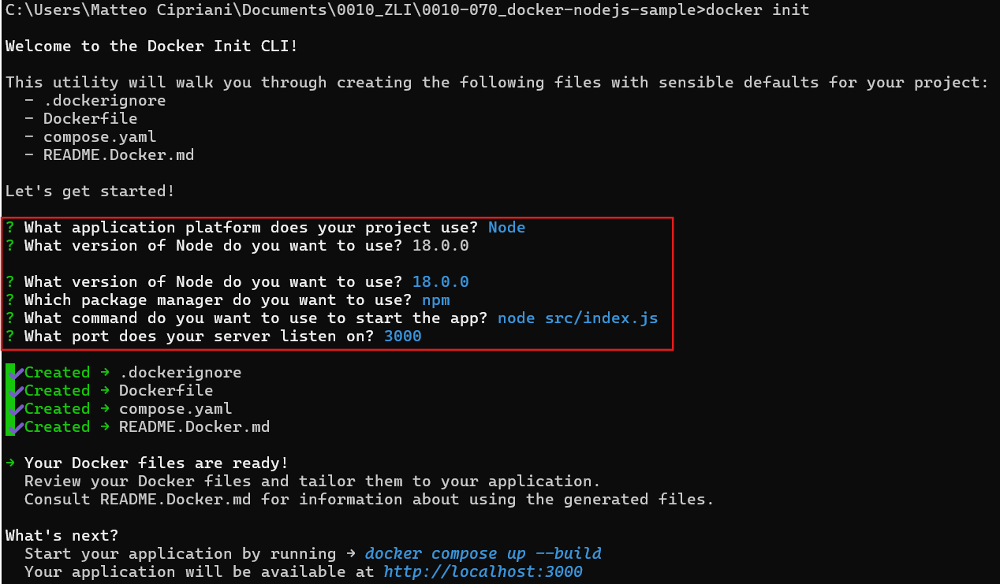

# Abschlussarbeit Git, Docker & Markdown

## Dokumentation

### Inhaltsverzeichnis

- [Abschlussarbeit Git, Docker \& Markdown](#abschlussarbeit-git-docker--markdown)
  - [Dokumentation](#dokumentation)
    - [Inhaltsverzeichnis](#inhaltsverzeichnis)
    - [GitHub-Fork erstellen](#github-fork-erstellen)
      - [Schritt 1 - Start](#schritt-1---start)
      - [Schritt 2 - Fork konfigurieren](#schritt-2---fork-konfigurieren)
      - [Schritt 3 - Link zum **eigenen** Repository kopieren](#schritt-3---link-zum-eigenen-repository-kopieren)
      - [Schritt 4 - Repository lokal klonen](#schritt-4---repository-lokal-klonen)
    - [Docker](#docker)
      - [Installation von Docker](#installation-von-docker)
      - [Aktivierung von WSL](#aktivierung-von-wsl)
      - [Docker Container erstellen](#docker-container-erstellen)

### GitHub-Fork erstellen

#### Schritt 1 - Start

Um eine [Fork](https://docs.github.com/en/pull-requests/collaborating-with-pull-requests/working-with-forks/fork-a-repo) auf [GitHub](https://www.github.com) erstellen zu können, muss man zuerst auf das Repository gehen, was man "forken" will. Danach kann man auf den Fork-Knopf drücken, was ein Menü öffnet, bei dem man wählen kann, wohin das Repository kopiert werden soll.

---

#### Schritt 2 - Fork konfigurieren

_Besitzer wählen, Namen des Repository angeben, Beschreibung hinzufügen (optional)_

---

#### Schritt 3 - Link zum **eigenen** Repository kopieren

Wenn man diese Schritte absolviert hat, kopiert man die Webadresse des **eigenen** Repository.

Hier kann man auch sehen, von wo dieses Repository geklont wurde.

---

#### Schritt 4 - Repository lokal klonen

Danach geht man in den Ordner, in den man das Repository kopieren will (erfolgt mit `cd path/to/desired/location`). Danach kann man mit `git clone <Link to your repository>` das Repository von GitHub lokal duplizieren.

_Der PATH zu meinem Ordner ist C:\Users\Matteo Cipriani\Documents\0010\_ZLI_

Das Klonen des GitHub Repository ist nun erfolgreich abgeschlossen.

---

### Docker

#### Installation von Docker

Wenn Sie Docker bereits installiert haben, können sie diesen Schritt überspringen. Um Docker zu installieren, folgen Sie [diesem Link](https://docs.docker.com/get-started/get-docker/). Danach können sie mit der Anleitung Docker installieren, die dort verlinkt ist, weitermachen.

---

#### Aktivierung von WSL

Um Docker verwenden zu können, müssen Sie WSL (Windows Subsystem for Linux) einrichten. Suchen sie dazu in den Einstellungen nach **Windows-Features ein- oder ausschalten**. Danach suchen sie folgende 2 Features und aktivieren Sie sie.

Nun könnten Sie eine Linux-Distribution wie Ubuntu installieren.

Als Nächstes müssen wir die Standartversion von WSL einstellen. Öffnen sie dazu ihr Terminal und führen Sie den Befehl `wsl --set-default-version 2` aus. Wenn keine Fehlermeldung erscheint, haben Sie alles richtig gemacht und können nun ihren ersten Docker Container erstellen.

---

#### Docker Container erstellen

Um ein Docker-Container zu erstellen, beginnt man mit `docker init`. Jedoch muss das in dem Ordner stattfinden, das zu einem Container werden sollte. Also müssen wir nochmals mit `cd` in den Ordner unserer Kopie des Repository gehen.

Danach können Sie `docker init` ausführen. Docker sucht mit diesem Befehl nach einem Container mit dem Namen ihres Ordners. Falls keiner existiert, leitet Daemon einen Download-Prozess aus dem Docker Repository ein und erstellt einen Container mit ihrem Ordnernamen.

Beim Initialisieren des Docker Containers müssen Sie die Fragen so beantworten, dass sie auf ihre Programmierumgebung gut angepasst sind. Für unser Beispiel, benutzen wir die Einstellungen, die im Bild zu sehen sind.

Als nächstes geben wir den Befehl `docker compose up --build` ein. Dies baut unseren Container und fügt automatisch die 3 Pakete - _.dockerignore, compose.yaml, Dockerfile_ - zu unserer IDE hinzu.

Wenn der Befehl erfolgreich abläuft, können sie mit der Tasteneingabe `V` Docker Desktop öffnen, und von da aus die Webseite. Falls das nicht geht, können sie auch über localhost:<Ihr Port, den sie eingestellt haben> zur Seite gelangen. Bei uns ist das localhost:3000. Anderenfalls können Sie die Website auch via der Docker Desktop App öffnen.

Danach können Sie im geöffneten Menü den Server starten und stoppen, oder die Webseite aufrufen

